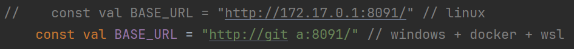
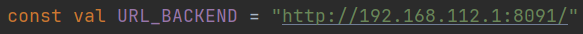
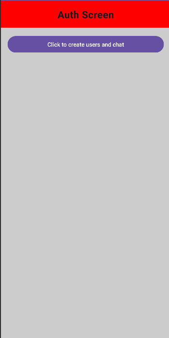
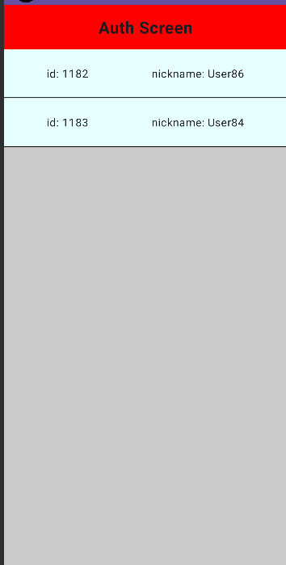
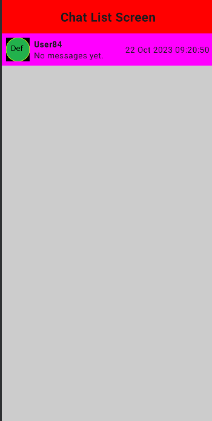
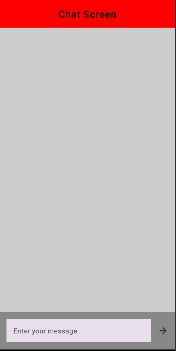
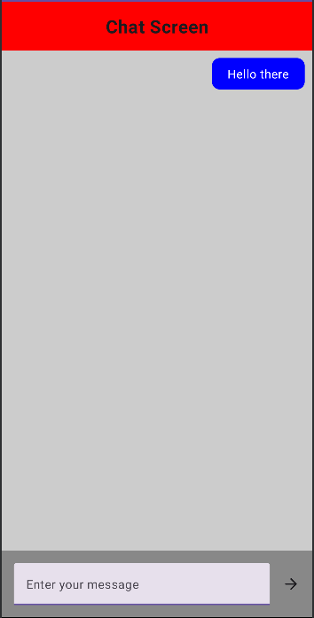

# Requirements (for local hosting):
* Docker
* Android Studio (emulator with Android 10+)

*Tested under Linux and Windows*

# Set up

## Android Studio

###  Set IPv4 address of server

Go to *android/app/src/main/java/com/example/chatexu/common/Constants.kt* 


1) Find line with URL_BACKEND constant

    

2)  Find and copy paste Docker's IP

    
    Windows: 
    
    Open CMD and type
    ``` 
    ipconfig 
    ```
    Example:
    `Ethernet adapter vEthernet (WSL):  IPv4 Address. . . . . . . . . . . : 172.29.96.1 `

    \
    Linux:
    ```
    ip a | grep docker
    ```
    Example: `3: docker0: 172.17.0.1`

\
Change `URL_BACKEND`



## Docker 
### Start Docker

Linux:
```
sudo systemctl start docker.service
```

### Build backend image:
```
docker build -t chatexu-server:0.3.0 .
```
### Start containers:
```
docker compose up
```

### Check if backend is running:
```
curl http://localhost:8091/test/hello
```
You should see: `Hello world!`


## Cleaning up

### Check if containers are running. 
```
docker ps
```
### If they are, stop them:
```
docker stop chatexu-db
```
```
docker stop chatexu-server
```


### Remove containers:
```
docker rm chatexu-db
```
```
docker rm chatexu-server
```

### Remove `chatexu server` image:
```
docker rmi chatexu-server:0.3.0
```

### (Optional) Remove other images, if no longer needed:
```
docker rmi mongo
```
```
docker rmi chatexu-server
```


# THIS SECTION IS DEPRECATED

## App overview







