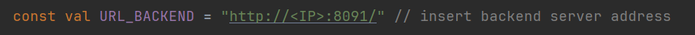
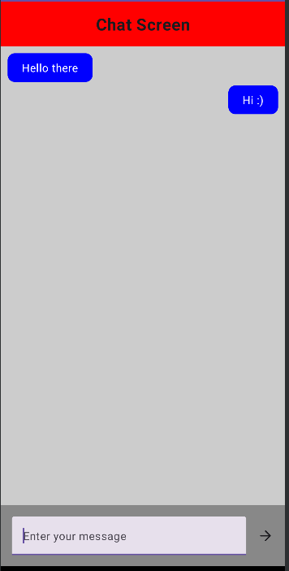

# Requirements:
* Docker
* Android Studio (for UI) + device with Android 10-13
* Postman (for server only)
* Internet connection (if required images are not in local repository)

*Tested under Linux and Windows*

# Set up

## Docker 
### Start Docker

Linux:
```
sudo systemctl start docker.service
```

### Start containers:
```
docker build -t chatexu-server:0.3.0 .
```
```
docker compose up
```

### Check if everything is running:
```
curl http://localhost:8091/test/hello
```
You should see: `Hello world!`


## Android Studio

###  Set IPv4 address of server

Go to *android/app/src/main/java/com/example/chatexu/common/Constants.kt* 


1) Find line with BASE_URL constant



2)  Find and copy paste Docker's IP

\
Windows 
``` 
ipconfig 
```
Example:
`Ethernet adapter vEthernet (WSL):  IPv4 Address. . . . . . . . . . . : 172.29.96.1 `

\
Linux:
```
ip a | grep docker
```
Example: `3: docker0: 172.17.0.1`

\
Change `BASE_URL`


## Cleaning up

### Check if containers are running. 
```
docker ps
```
### If they are, stop them:
```
docker stop chatexu-db
```
```
docker stop chatexu-server
```


### Remove containers:
```
docker rm chatexu-db
```
```
docker rm chatexu-server
```

### Remove `chatexu server` image:
```
docker rmi chatexu-server:0.3.0
```

### (Optional) Remove other images, if no longer needed:
```
docker rmi mongo
```
```
docker rmi openjdk:21-jdk
```

# App overview

For now, UI is, well, poor. You can create users by button, open chats, and write messages. Chat is live, so You can write from two emulators to each other.



